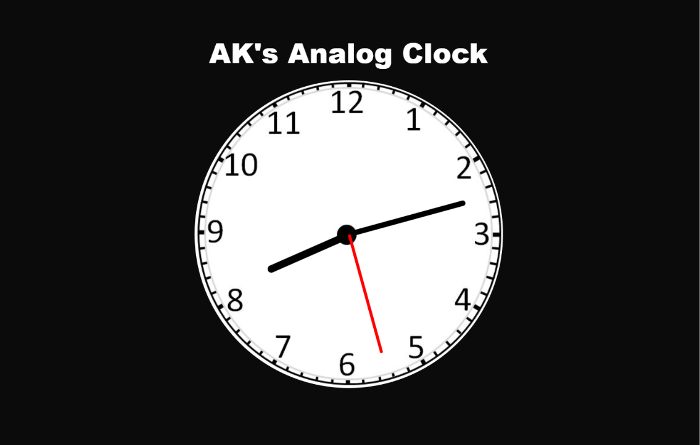

# ⏰ AK's Analog Clock

A simple and responsive Analog Clock built using **HTML**, **CSS**, and **JavaScript**. The clock displays the current system time and updates the hour, minute, and second hands in real time.

## 🚀 Features

* Real-time analog clock
* Smooth rotation of clock hands
* Responsive design
* Pure HTML, CSS, and JavaScript

## 🛠️ Technologies Used

* HTML5
* CSS3
* JavaScript (ES6)

## 📂 Project Structure

```text
AK's Analog-Clock/
│── index.html
│── clock.css
│──  clock.js
│── README.md
```

## ⚙️ How It Works

* The JavaScript `Date()` object fetches the current system time.
* The hour, minute, and second values are converted into rotation angles.
* CSS `transform: rotate()` is used to rotate the clock hands.
* The clock updates continuously using `setInterval()`.

### Rotation Formula

```javascript
```IMP things

Hour Hand   = (hours × 30) + (minutes × 0.5) + (seconds × 0.5 / 60)

Minute Hand = (minutes × 6) + (seconds × 0.1)

Second Hand = (seconds × 6) + (milliseconds × 0.006)
```

## ▶️ How to Run

1. Download or clone this repository.
2. Open the project folder.
3. Open `index.html` in your browser.

No installation or setup is required.

## 📸 Screenshot

Screenshot of the Analog Clock.
👇👇👇



## 🎯 Future Improvements

* Dark/Light Mode
* Multiple Themes
* Digital Clock
* Time Zone Support
* Alarm Feature (In my Option)

## 👨‍💻 Author

**Aqdas Khan (AK)**

**GitHub**: https://github.com/AqdasKhan313/AK-s-Analog-Clock.git
**Demo**: 

---

⭐ If you like this project, consider giving it a star on GitHub !!!